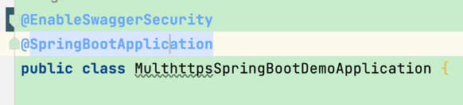

# 安全的swagger

## 简介

`xwc1125-security-swagger` 是一个安全使用`swagger`的jar。此项目的目的是：
避免因开发或运维操作不当，未在线上环境关闭swagger的访问从而导致安全风险或工单。
因此，`xwc1125-security-swagger`强烈限制`prod`环境下`swagger`的使用。

此项目是在springdoc 的基础进行二次封装。

## 功能说明

1. `swagger3`只能在`spring.profiles.active=dev`或`spring.profiles.active=test`环境下才能启用；
2. 访问`swagger-ui`时需要输入账户/密码。如果`swagger.basic.password`
   未设置，那么系统会自动生成访问的密钥，密钥在日志中打印。日志标记为：`[swagger]default basic password`
3. 在`dev`和`test`环境下可以通过配置`swagger.enabled`启动或禁用`swagger3`

## 使用

### 包配置

- Maven

```
<dependency>
    <groupId>com.xwc1125</groupId>
    <artifactId>xwc1125-sercurity-swagger</artifactId>
    <version>1.0.0</version>
</dependency>
```

- Gradle:

```
dependencies {
	implementation 'com.xwc1125:xwc1125-sercurity-swagger:1.0.0'
}
```

### 启动配置

在Application上添加`@EnableSwaggerSecurity`注解



### application中的配置：

```yaml
spring:
  profiles:
    active: test
  main:
    allow-circular-references: true # 解决因循环引用导致启动时报错的问题
swagger:
  enabled: true # 启动或禁用swagger
  info:
    title: api文档 # 标题
    description: api描述 # 描述
    version: "v1.0.0" # 版本
    termsOfService: # 服务条款
    license:
      name: Apache 2.0 # 许可协议
      url: https://www.apache.org/licenses/LICENSE-2.0.html #许可证URL
    contact:
      name: xwc1125
      url: https://github.com/xwc1125
      email: xwc1125@qq.com
  externalDoc:
    description: SpringDoc Full Doc
    url: https://springdoc.org/
  securitySchemes:
    "bearer-key":
      type: http # apiKey,http,oauth2,openIdConnect,mutualTLS
      scheme: bearer
      bearerFormat: JWT
    "basicScheme":
      type: http
      scheme: basic
  headers:
    "myHeader2":
      description: "myHeader2 header"
      schema:
        type: string
        format:
      extensions:
        "name": "myHeader2"
  servers: # 调试服务
    - url: "http://127.0.0.1:8080"
      description: local
    - url: "http://127.0.0.1:9091"
      description: "test"
  basic:
    username: admin
    password: admin # 如果密码不填，会根据系统信息生成密码，生成的密码在日志可见。[swagger]default basic password:

# 原生的springdoc配置，正常使用
springdoc: # 具体配置请参考 https://springdoc.org/#properties
  version: v1.0.1
```

至此，应用就能够正常使用了。

### Swagger3(OpenAPI3)注解使用

本jar启用的是`Swagger3(OpenAPI3)`

| Swagger2 | OpenAPI3 | 注解位置 |
|---|---|---|
|@Api    |@Tag(name="接口描述")    |Controller类之上|
|@ApiOperation    |@Operation(summary="接口方法描述")    |Controller方法上|
|@ApiImplicitParams    |@Parameters({@Parameter(description="参数描述")})    |Controller方法上|
|@ApiImplicitParam    |@Parameter(name="参数名", description="参数描述")    |Controller方法上|
|@ApiParam    |@Parameter(name="参数名",description="参数描述")    |Controller方法上|
|@ApiIgnore    |@Parameter(hidden=true)或@Operation(hidden=true)或@Hidden    |Controller方法上|
|@ApiModel    |@Schema    |DTO类上|
|@ApiModelProperty    |@Schema    |DTO属性上|

springfox和springdoc注解映射关系：

```
@Api -> @Tag
@ApiIgnore -> @Parameter(hidden = true) or @Operation(hidden = true) or @Hidden
@ApiImplicitParam -> @Parameter
@ApiImplicitParams -> @Parameters
@ApiModel -> @Schema
@ApiModelProperty(hidden = true) -> @Schema(accessMode = READ_ONLY)
@ApiModelProperty -> @Schema
@ApiOperation(value = "foo", notes = "bar") -> @Operation(summary = "foo", description = "bar")
@ApiParam -> @Parameter
@ApiResponse(code = 404, message = "foo") -> @ApiResponse(responseCode = "404", description = "foo")
```

### springdoc 配置

```yaml
springdoc: # 具体配置请参考 https://springdoc.org/#properties
  version: v1.0.1
  packages-to-scan: "*" # List of Strings.要扫描的包列表（逗号分隔）
  paths-to-match: "/*" # List of Strings.要匹配的路径列表（逗号分隔）
  produces-to-match: "/*" # List of Strings.要匹配的生产媒体类型列表（逗号分隔）
  headers-to-match: "/*" # List of Strings.要匹配的标题列表（逗号分隔）
  consumes-to-match: "/*" # List of Strings. 要匹配的消耗媒体类型列表（逗号分隔）
  paths-to-exclude: "/err" # List of Strings.要排除的路径列表（逗号分隔）
  packages-to-exclude: "/err" # List of Strings.要排除的包列表（逗号分隔）
  default-consumes-media-type: "application/json" # String. 默认使用媒体类型。
  default-produces-media-type: "/" # String.默认产生媒体类型
  auto-tag-classes: true # Boolean. 禁用 springdoc-openapi 自动标签。
  model-and-view-allowed: false # Boolean. 允许带有 ModelAndView 返回的 RestControllers 出现在 OpenAPI 描述中。
  override-with-generic-response: true # Boolean. 当为 true 时，自动将 @ControllerAdvice 响应添加到所有生成的响应中。
  remove-broken-reference-definitions: true # Boolean. 禁用删除损坏的参考定义。
  writer-with-default-pretty-printer: false # Boolean. 启用 OpenApi 规范的漂亮打印。
  cache:
    disabled: false # Boolean. 禁用计算的 OpenAPI 的 springdoc-openapi 缓存。
  api-docs:
    enabled: true # 禁用 springdoc-openapi 端点（默认为 /v3/api-docs）
    groups:
      enabled: true # Boolean. 禁用 springdoc-openapi 组。
    version: openapi_3_0 # String. 选择OpenAPI 3.0或OpenAPI 3.1（使用值OPENAPI_3_1）
    path: "/v3/api-docs" # String, 用于 Json 格式的 OpenAPI 文档的自定义路径。
    resolve-schema-properties: false # Boolean. 在@Schema（名称、标题和描述）上启​​用属性解析器。
  webjars:
    prefix: "/webjars" # String, 更改 spring-webflux 的 swagger-ui 的 URL 可见的 webjars 前缀。
  group-configs[0]:
    group: "default" # String.组名
    displayName: "default" # String.组的显示名称。
    packages-to-scan: "*" # List of Strings.要扫描组的包列表（逗号分隔）
    paths-to-match: "/*" # List of Strings. 组匹配的路径列表（逗号分隔）
    paths-to-exclude: "/err" # List of Strings. 为组排除的路径列表（逗号分隔）
    packages-to-exclude: "" # List of Strings. 为一个组排除的包列表（逗号分隔）
    produces-to-match: "/*" # List of Strings.要匹配的生产媒体类型列表（逗号分隔）
    consumes-to-match: "/*" # List of Strings. 要匹配的消耗媒体类型列表（逗号分隔）
    headers-to-match: "/*" # List of Strings.要匹配的标题列表（逗号分隔）
  swagger-ui:
    enabled: true # Boolean. 禁用 swagger-ui 端点（默认为 /swagger-ui.html）。
    path: "/swagger-ui.html" # String, 用于 swagger-ui HTML 文档的自定义路径。
    configUrl: "/v3/api-docs/swagger-config" # String. 从中获取外部配置文档的 URL。
    layout: "BaseLayout" # String. 可通过插件系统用作 Swagger UI 的顶级布局的组件的名称。
    validatorUrl: "validator.swagger.io/validator" # 默认情况下，Swagger UI 尝试根据 swagger.io 的在线验证器验证规范。您可以使用此参数设置不同的验证器 URL，例如为本地部署的验证器Validator Badge。将其设置为none或将禁用验证。127.0.0.1localhost
    tryItOutEnabled: false # Boolean. 控制是否应默认启用“试用”部分。
    filter: false # Boolean OR String. 如果设置，则启用过滤。顶部栏将显示一个编辑框，您可以使用它来过滤显示的标记操作。可以是启用或禁用的布尔值，也可以是字符串，在这种情况下，将使用该字符串作为过滤器表达式启用过滤。过滤区分大小写，匹配标记内任何位置的过滤器表达式。
    operationsSorter: method # Function=(a ⇒ a). 对每个 API 的操作列表应用排序。它可以是“alpha”（按字母数字路径排序）、“method”（按 HTTP 方法排序）或函数（请参阅 Array.prototype.sort() 以了解排序函数的工作原理）。默认是服务器返回的顺序不变。
    tagsSorter: "" # Function=(a ⇒ a). 对每个 API 的标签列表应用排序。它可以是 'alpha'（按字母数字路径排序）或函数（参见 Array.prototype.sort()以了解如何编写排序函数）。每次传递都会将两个标签名称字符串传递给分拣机。默认是 Swagger UI 确定的顺序。
    oauth2RedirectUrl: "/swagger-ui/oauth2-redirect.html" # String. OAuth 重定向 URL。
    displayOperationId: false # Boolean. 控制 operationId 在操作列表中的显示。默认值为false.
    displayRequestDuration: false # Boolean. 控制“试用”请求的请求持续时间（以毫秒为单位）的显示。
    deepLinking: false # Boolean. 如果设置为true，则启用标签和操作的深度链接。有关详细信息，请参阅 [深度链接文档](/docs/usage/deep-linking.md)。
    disable-swagger-default-url: false # Boolean. 禁用 swagger-ui 默认 petstore url。（自 v1.4.1 起可用）。
    use-root-path: false # Boolean. 如果设置为 true，则可以直接从应用程序根路径访问 swagger-ui。
    persist-authorization: false # Boolean. 如果设置为 true，它将保留授权数据，并且不会在浏览器关闭/刷新时丢失
    oauth:
      clientId: "" # String. 默认客户端 ID。必须是一个字符串。
      clientSecret: "" # String. 默认客户端秘密。切勿在生产环境中使用此参数。它暴露了关键的安全信息。此功能仅适用于开发/测试环境。
      realm: "" # String. 领域查询参数（用于 OAuth 1）添加到 authorizationUrl 和 tokenUrl。
      appName: "" # String. OAuth 应用程序名称，显示在授权弹出窗口中。
      scopeSeparator: "" # String. 用于传递作用域的 OAuth 作用域分隔符，调用前编码，默认值为空格（编码值 %20）。
      csrf:
        enabled: false # Boolean. 启用 CSRF 支持
        use-local-storage: false # Boolean. 从本地存储中获取 CSRF 令牌。
        use-session-storage: false # Boolean. 从会话存储中获取 CSRF 令牌
        cookie-name: "XSRF-TOKEN" # String. 可选的 CSRF，用于设置 CSRF cookie 名称。
        header-name: "X-XSRF-TOKEN" # String. 可选的 CSRF，用于设置 CSRF 标头名称。
      use-basic-authentication-with-access-code-grant: false # Boolean. 仅针对 accessCode 流激活。在向 tokenUrl 发出 authentication_code 请求期间，使用 HTTP 基本身份验证方案（使用基本 base64encode(client_id + client_secret) 的授权标头）传递客户端密码。
      use-pkce-with-authorization-code-grant: false # Boolean.仅适用于授权码流。代码交换的证明密钥为 OAuth 公共客户端带来了增强的安全性。
```

## 证书

`xwc1125-sercurity-swagger` 的源码允许用户在遵循 [Apache 2.0 开源证书](LICENSE) 规则的前提下使用。

## 版权

Copyright@2022 xwc1125


